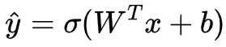
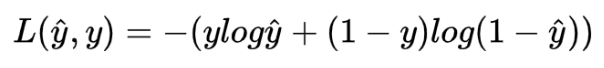
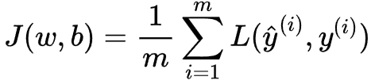

# numpy构建基本函数

1. 画出Active函数（激活函数）

2. 画出损失函数（Loss函数）

3. 画出成本函数（Cost函数）

# Answer
1. Active函数（激活函数）:
")
2. 损失函数（Loss函数）：
")
3. 画出成本函数（Cost函数）:
")


```python
import matplotlib.pyplot as plt
import numpy as np
import numpy.random

from matplotlib import cm

TRAIN_DATA_X = 1
TRAIN_DATA_Y = 0


def draw_3d(X, Y, Z):
    fig, ax = plt.subplots(subplot_kw={"projection": "3d"})
    ax.plot_surface(X, Y, Z, vmin=Z.min() * 2, cmap=cm.Blues)
    plt.show()


def linear(w, b, x=TRAIN_DATA_X):
    return w * x + b


def sigmoid(x):
    return 1 / (1 + np.exp(-x))


def loss(yhat, y=TRAIN_DATA_Y):
    return -(y * np.log(yhat) + (1 - y) * np.log(1 - yhat))


# Make data
W = np.arange(-5, 5, 0.25)
B = np.arange(-5, 5, 0.25)
W, B = np.meshgrid(W, B)

R = linear(w=W, b=B)
Z = sigmoid(x=R)

draw_3d(X=W, Y=B, Z=Z)

Z = loss(yhat=Z)
draw_3d(X=W, Y=B, Z=Z)


CNT_data_set = 1000
train_datax = numpy.random.randn(CNT_data_set, 1)
train_datay = numpy.random.randint(low=0, high=2, size=CNT_data_set).reshape(CNT_data_set, 1)

RESULT = numpy.zeros((40, 40))
for i in range(CNT_data_set):
    X = train_datax[i]
    Y = train_datay[i]
    R = linear(w=W, b=B, x=X)
    Z = sigmoid(x=R)
    Z = loss(yhat=Z, y=Y)
    RESULT += Z

RESULT /= CNT_data_set

draw_3d(X=W, Y=B, Z=RESULT)


```

